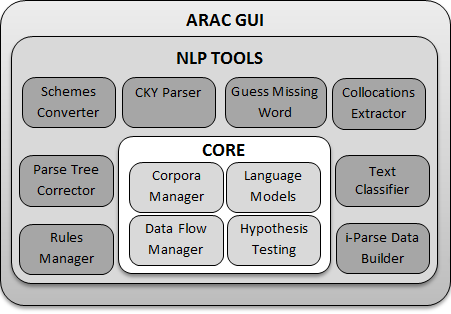
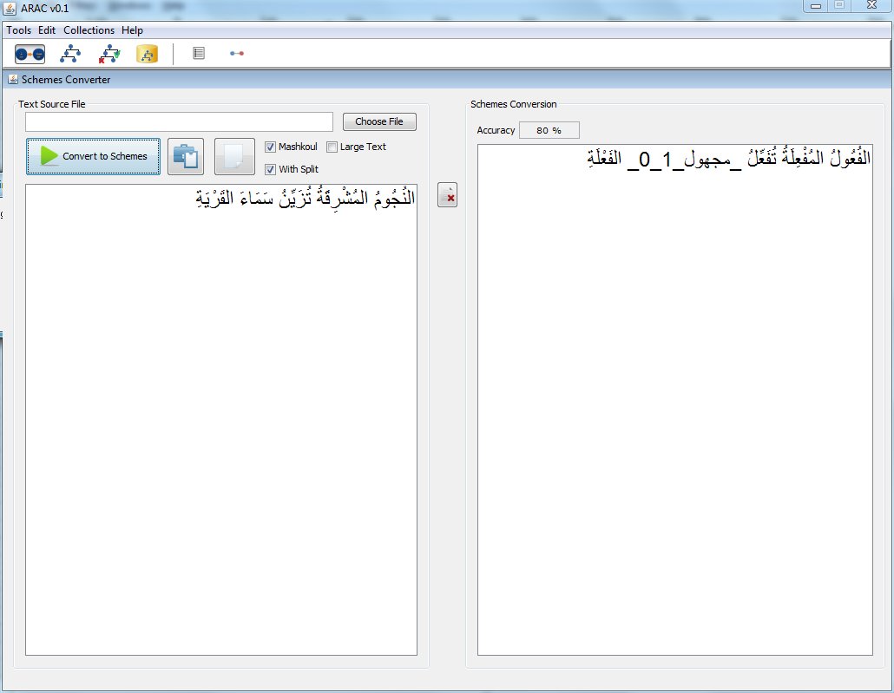
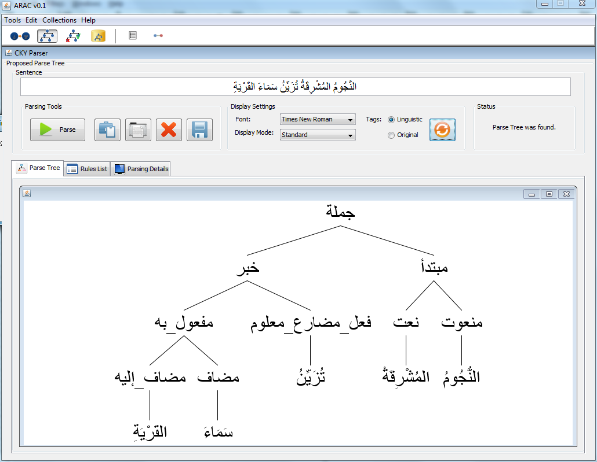
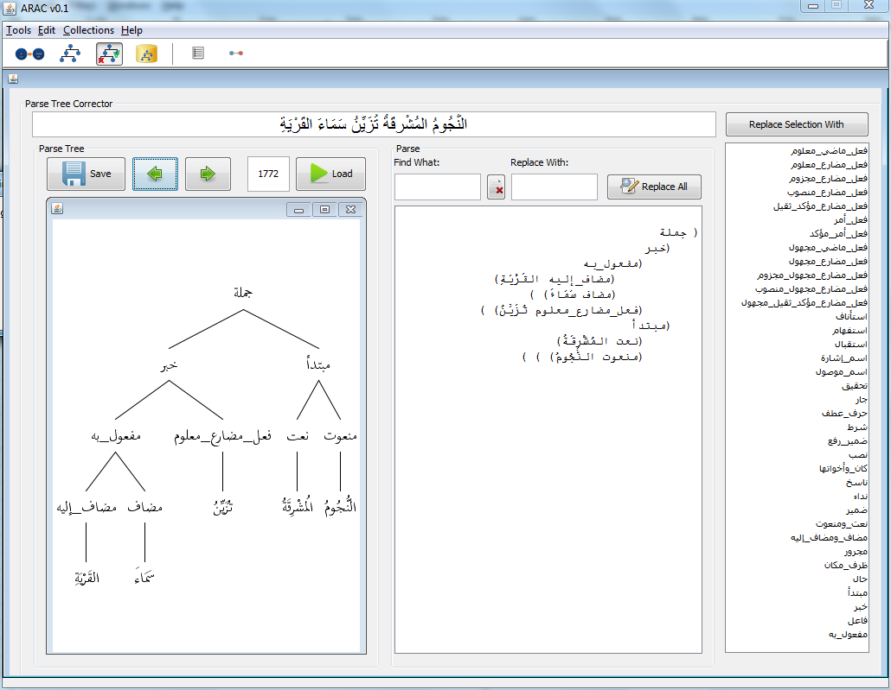
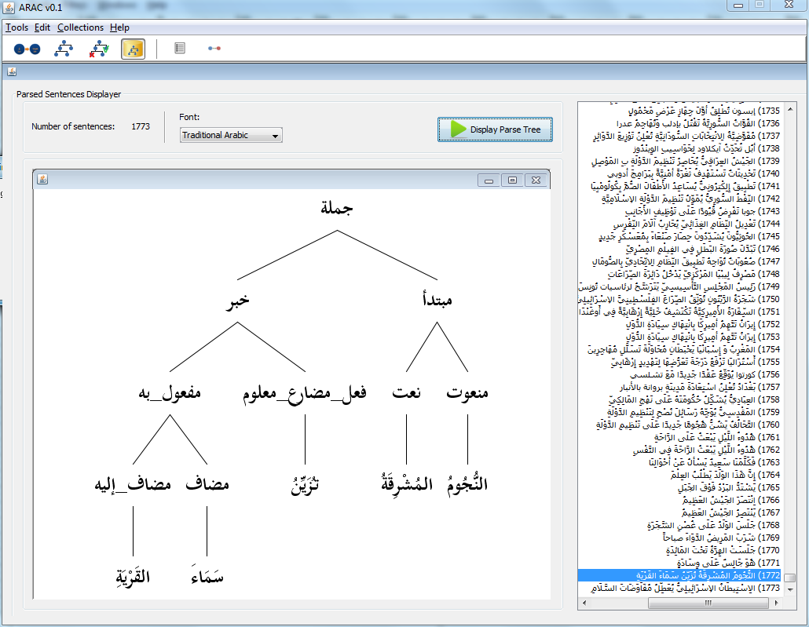
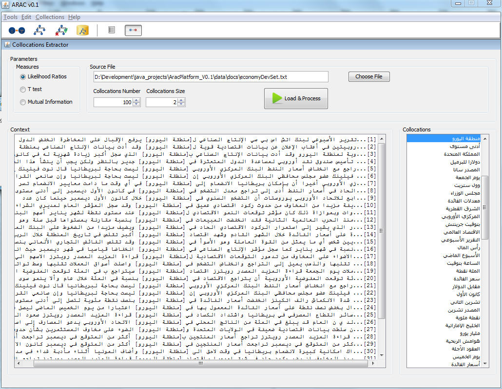

 v0.1

##Introduction
ARAC is a natural language processing tool for Arabic.       
ARAC platform provides: 
-	A text to schemes converter.     
-	A schemes-based PCFG parser for Arabic.     
-	A manual parsing corrector.     
-	A collocation extractor.       

##Architecture

##Screenshots
**Text to schemes converter**

**Schemes-based PCFG parser**

**Manual parsing corrector**

**Parsed sentences**

**Collocation extraction**

ARAC platform is free software; it’s distributed in the hope that it will be useful.    
http://dx.doi.org/10.5281/zenodo.18791     

Mohamed Achraf BEN MOHAMED     
mohamedachraf@gmail.com
